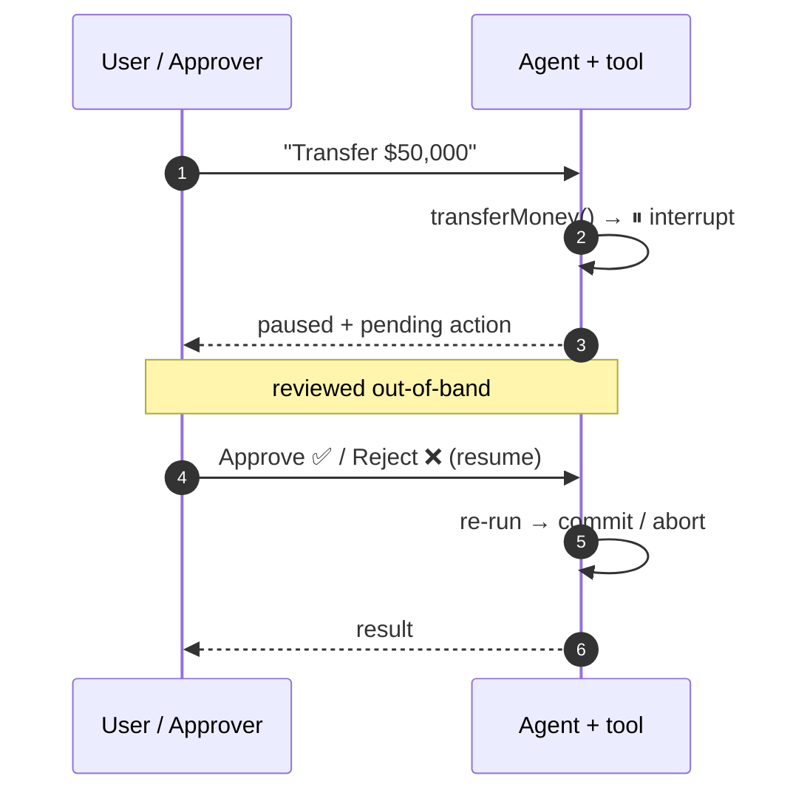

# Keeping Agents on a Leash

## Human-in-the-Loop, the Interrupt Paradigm & RBAC

<div class="pt-8 opacity-80 text-lg">

Deterministic safety boundaries for autonomous agents — in **Genkit** & **LangGraph.js**

</div>

<div class="abs-br m-6 text-sm opacity-70">
  Maina Wycliffe · I/O Extended
</div>

<!--
Welcome. Today is about the unglamorous engineering that stands between "cool agent demo"
and "agent that just wired $50k to the wrong account." We'll build the mental model first,
then build that pattern in two frameworks — Genkit and LangGraph.js — with RBAC throughout.
-->

---
layout: default
---

# What you'll leave with

<v-clicks>

- **A mental model** for *when* an agent must stop and ask a human
- The **Interrupt paradigm** — pause an executing agent *before* a high-risk action commits
- How to **build that gate** in both **Genkit** and **LangGraph.js**
- Why a **deterministic code gate** beats prompt-only guardrails
- Where **RBAC** fits — enforcing *who* may approve, server-side

</v-clicks>

<div v-click class="mt-8 text-sm opacity-70">

</div>

<!--
Three takeaways: the concept, building it in code, and the RBAC guardrails. Hold me to it.
-->

---
layout: section
---

# Act 1
## Why agents need brakes

---

# The capability ladder

<div class="grid grid-cols-3 gap-4 mt-12">

<div v-click class="p-5 rounded-lg border border-[#4285f4]/50">

### 🗨️ Chatbot
Generates **text**.

Worst case: a wrong answer.

</div>

<div v-click class="p-5 rounded-lg border border-[#fbbc04]/70">

### 🛠️ Tool-using agent
Generates **actions**.

Calls APIs, reads data, drafts changes.

</div>

<div v-click class="p-5 rounded-lg border border-[#ea4335]/60">

### 🤖 Autonomous agent
**Acts in a loop**, unattended.

Moves money. Deletes records. Emails customers.

</div>

</div>

<div v-click class="mt-12 text-center text-xl">

As capability climbs, the **blast radius** of a single bad token climbs with it.

</div>

<!--
The jump from text to actions is the whole story. A hallucinated sentence is embarrassing.
A hallucinated tool call is a transaction.
-->

---
layout: fact
---

# An LLM is a <span class="text-amber-400">probabilistic</span> system

## driving <span class="text-red-400">deterministic</span> consequences

<div v-click class="mt-8 text-lg opacity-80">

A 99% reliable agent making 100 high-risk calls a day fails **~once a day**.

</div>

<!--
This is the core tension. You can lower the probability of a mistake. You cannot make it zero
with prompting. So you need a boundary that doesn't depend on the model behaving.
-->

---

# "Just prompt it not to" doesn't hold

<v-clicks>

- Prompts are **suggestions**, weighted — not **guarantees**, enforced
- Models **hallucinate** arguments: right intent, wrong account number
- **Prompt injection** turns your data into someone else's instructions
- The model **cannot authorize itself** — that's a decision about *authority*, not language

</v-clicks>

<div v-click class="mt-10 p-4 rounded-lg bg-[#fbbc04]/10 border border-[#fbbc04]/50">

We need a boundary that holds **even when the model is wrong** — a *deterministic* one.

</div>

<!--
Every guardrail you put in the prompt shares the model's failure mode. If the model is the
thing that's unreliable, the model cannot also be the safety mechanism.
-->

---
layout: center
class: text-center
---

# The thesis

<div class="text-2xl mt-6 leading-relaxed">

Keep a **human in the loop** by giving the agent an<br/>
**interrupt**: pause *before* the irreversible step,<br/>
hand control to a person, and gate that person with **RBAC**.

</div>

<div v-click class="mt-10 text-lg opacity-70">

Pause → Approve → Resume. Enforced in code, not in the prompt.

</div>

---
layout: section
---

# Act 2
## The Interrupt paradigm

---

# What is an interrupt?

<div class="mt-6 text-xl">

A first-class way for an executing agent to **stop itself** — mid-flow, before a
high-risk action commits — **persist** where it was, and **hand control back** to your code.

</div>

<div class="grid grid-cols-2 gap-8 mt-10">

<div v-click>

### Without an interrupt
The tool runs. You find out **after**.

```text
think → call transferMoney() → 💸 done
```

</div>

<div v-click>

### With an interrupt
The tool **pauses itself**. You decide **before**.

```text
think → transferMoney() → ⏸ PAUSE
        → human approves → ▶ resume → 💸
```

</div>

</div>

<!--
The key word is BEFORE. An audit log tells you what went wrong yesterday. An interrupt stops
it from happening today.
-->

---

# Anatomy of a gate

<div class="mt-4">

<v-clicks>

1. **Classify risk** — is *this* call dangerous enough to pause? (amount, scope, irreversibility)
2. **Pause** — the agent suspends instead of executing
3. **Persist** — the flow's state is saved so it can resume later (maybe on another request)
4. **Surface** — the pending action is shown to a human as a structured decision
5. **Decide** — approve / reject / edit, by *someone allowed to* (RBAC)
6. **Resume** — the agent continues from where it paused, with the verdict

</v-clicks>

</div>

<div v-click class="mt-8 text-sm opacity-70">

Frameworks differ on **how** they persist and resume — but every one of them is this loop.

</div>

---

# The approval loop



<!--
The backend looks stateless but the flow's pause is durable — persisted, then resumed. The
human decides out-of-band, through whatever channel you build; the agent just pauses and waits.
-->

---
layout: center
---

# Every gate answers two questions

<div class="grid grid-cols-2 gap-10 mt-10">

<div v-click class="p-6 rounded-lg border border-[#4285f4]/50">

## 1. Should this pause?
**Risk classification.**

Amount over a threshold? Destructive? Irreversible? Touches another user's data?

*→ decides the interrupt fires*

</div>

<div v-click class="p-6 rounded-lg border border-[#34a853]/50">

## 2. Who may approve?
**Authorization (RBAC).**

Is this principal allowed to *take* — or *approve* — this action at all?

*→ decides whose "yes" counts*

</div>

</div>

<div v-click class="mt-10 text-center text-lg opacity-80">

The interrupt handles **#1**. RBAC handles **#2**. You need both.

</div>

---

# RBAC: authority lives on the server

<v-clicks>

- An interrupt asks *"is this okay?"* — RBAC decides *"are **you** allowed to say so?"*
- Gate **two** things: who can **trigger** the action, and who can **approve** it
- **Least privilege**: the agent runs as the *user*, not as an omnipotent service account
- Identity is checked **server-side on every step** — including on **resume**

</v-clicks>

<div v-click class="mt-8 p-4 rounded-lg bg-[#ea4335]/10 border border-[#ea4335]/40">

Anti-pattern: a hidden "approve" button the model can "click." If the model can authorize, you
have **no** gate — you've just added a step the model controls.

</div>

<!--
The approval has to come from outside the model's reach. If the resume call doesn't re-check
who's asking, an attacker just calls /resume directly.
-->

---
layout: statement
---

# The agent pauses.
# A **human** is the gate.

<div v-click class="mt-8 text-lg opacity-70 text-center">

Not the prompt. Not the model. A decision made outside the model — and enforced in your code.

</div>

---
layout: section
---

# Act 3
## Building the gate

---

# One concept, two implementations

<div class="mt-8 text-lg">

We'll write the **same** "pause before a big transfer" gate in:

</div>

<div class="grid grid-cols-2 gap-6 mt-8">

<div v-click class="p-5 rounded-lg border border-[#fbbc04]/70 text-center">

### 🔥 Genkit
`interrupt()` inside a tool

*message / tool-centric*

</div>

<div v-click class="p-5 rounded-lg border border-[#34a853]/60 text-center">

### 🕸️ LangGraph.js
`interrupt()` inside a node

*graph-state-centric*

</div>

</div>

<div v-click class="mt-10 text-center opacity-80">

Same idea. Different plumbing for **persist** and **resume**.

</div>

---

# Genkit — a tool that pauses itself

<div class="text-sm">

````md magic-move {lines: true}
```ts
// A normal Genkit tool.
export const transferMoney = ai.defineTool(
  { name: 'transferMoney', inputSchema, outputSchema },
  async (input) => {
    return doTransfer(input);   // 😱 commits immediately
  },
);
```

```ts
// The tool receives an injected `interrupt()` helper.
export const transferMoney = ai.defineTool(
  { name: 'transferMoney', inputSchema, outputSchema },
  async (input, { interrupt, resumed }) => {
    // High-risk + not yet approved → pause this flow.
    if (resumed?.status !== 'APPROVED' && input.amount > 1_000) {
      interrupt({ reason: 'needs approval', ...input });
    }
    return doTransfer(input);
  },
);
```

```ts
// Handle the verdict on resume — including rejection.
export const transferMoney = ai.defineTool(
  { name: 'transferMoney', inputSchema, outputSchema },
  async (input, { interrupt, resumed }) => {
    if (resumed?.status === 'REJECTED') {
      return { status: 'REJECTED', message: 'Cancelled by approver.' };
    }
    if (resumed?.status !== 'APPROVED' && input.amount > 1_000) {
      interrupt({ reason: 'needs approval', ...input });
    }
    return doTransfer(input);   // only reached once APPROVED
  },
);
```
````

</div>

<!--
The magic: interrupt() throws a special signal the generate loop catches. The tool literally
suspends itself. `resumed` is how the verdict comes back in.
-->

---

# Genkit — detect & resume

<div class="text-sm">

```ts {all|2-5|7-9|12-21|all}
// Run the agent — it may pause on a high-risk tool call.
let response = await ai.generate({ prompt, tools: [transferMoney] });

// Did it pause instead of finishing?
if (response.finishReason === 'interrupted') {
  const pending = response.interrupts[0];
  const decision = await waitForHumanDecision(pending);

  // Resume the SAME conversation, restarting the tool with the verdict.
  response = await ai.generate({
    tools: [transferMoney],
    messages: response.messages,
    resume: {
      restart: transferMoney.restart(pending, {
        status: decision.approved ? 'APPROVED' : 'REJECTED',
      }),
    },
  });
}
```

</div>

<div class="mt-2 text-sm opacity-70">

Two resume modes: **`restart`** re-runs the tool with your verdict (our gate); **`respond`** answers a `defineInterrupt` question the agent asked you.

</div>

---

# LangGraph.js — approval is a *node*

<div class="text-sm">

```ts {all|3-9|12-16|18-21}
import { interrupt, Command, MemorySaver, StateGraph, START, END } from '@langchain/langgraph';

// The gate is a graph NODE. ⚠️ It RE-RUNS from the top on resume.
async function approveTransfer(state) {
  const approved = interrupt({
    question: `Transfer $${state.amount} to ${state.to}?`,
  });
  if (!approved) return { status: 'rejected' };
  return doTransfer(state);          // side effect AFTER the interrupt
}

// Wire the node in; a checkpointer + thread_id make the pause durable.
const graph = new StateGraph(State)
  .addNode('approve', approveTransfer)
  .addEdge(START, 'approve').addEdge('approve', END)
  .compile({ checkpointer: new MemorySaver() });

const config = { configurable: { thread_id: 'session-42' } };
const paused = await graph.invoke(input, config);
console.log(paused.__interrupt__);                  // pending value
await graph.invoke(new Command({ resume: true }), config);
```

</div>

<!--
The gate is a node wired between START and END. The checkpointer is mandatory — no persistence,
no interrupt. The node re-executes from the top on resume, so anything before interrupt() runs
twice — keep side effects after it, or make them idempotent. Resume input must be
`new Command({ resume })` — not Command({ update }), which is for returning from a node.
-->

---

# RBAC: authority lives in the agent

<div class="text-sm">

<<< @/snippets/genkit-rbac.ts ts {all|4-6|8-10|15-16}

</div>

<!--
Two deployment shapes. On Firebase, onCallGenkit + hasClaim gates before the flow runs. Self-
hosted, you read context.auth inside the flow. Either way: authority is server-side, re-checked
on resume.
-->

---

# Why a code gate beats a prompt guardrail

<div class="grid grid-cols-2 gap-8 mt-8">

<div v-click>

### Prompt-only "guardrail"
- Shares the model's failure mode
- Bypassed by **injection**
- No record of **who** decided
- The model can "approve" itself

</div>

<div v-click>

### Interrupt + RBAC in code
- Holds **even when the model is wrong**
- The decision happens **outside** the model
- Every approval is **attributable** (audit)
- Authority is enforced **server-side**

</div>

</div>

<div v-click class="mt-10 p-4 rounded-lg bg-[#34a853]/10 border border-[#34a853]/40 text-center">

A deterministic check in your code is a **boundary**. A sentence in a system prompt is a wish.

</div>


---
layout: center
class: text-center
---

# Takeaways

<div class="text-left max-w-2xl mx-auto mt-6 text-lg leading-relaxed">

<v-clicks>

1. Autonomous agents need **deterministic** boundaries — prompts aren't enough
2. The **interrupt** is that boundary: pause *before* the irreversible step
3. **Same pattern** in Genkit & LangGraph.js — only persist/resume differ
4. **RBAC** decides whose "yes" counts — authority enforced server-side, re-checked on resume

</v-clicks>

</div>

---
layout: end
class: text-center
---

# Thank you

<div class="mt-6 text-lg opacity-80">

Slides & code → **github.com/mainawycliffe/io-extended-slides**

</div>

<div class="mt-8 text-sm opacity-70">

Genkit interrupts · LangGraph.js `interrupt()`
<br/>
Keep a human in the loop. 🪢
Simbacares123?
</div>
